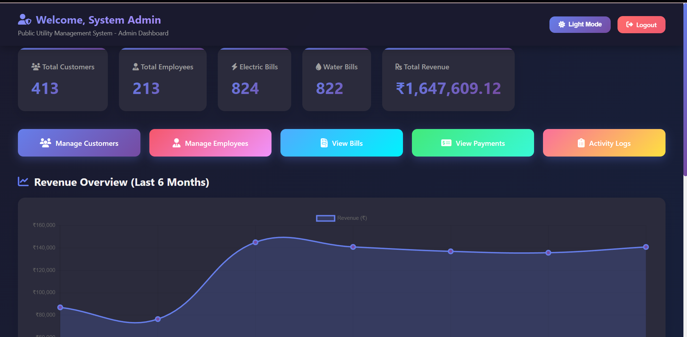
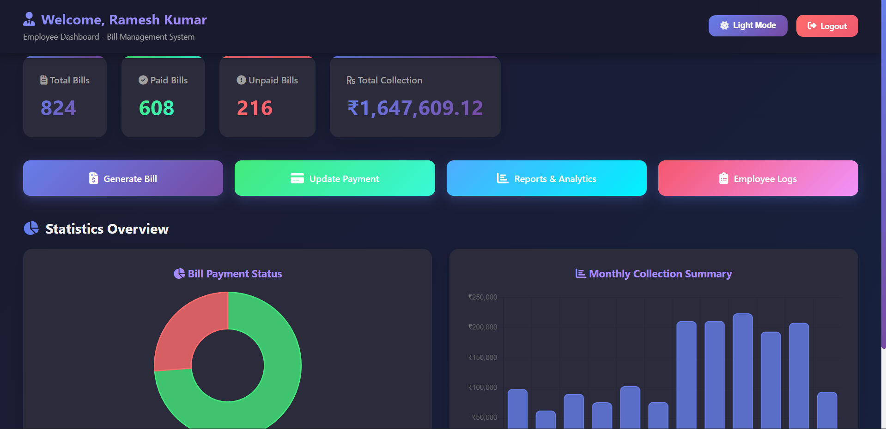
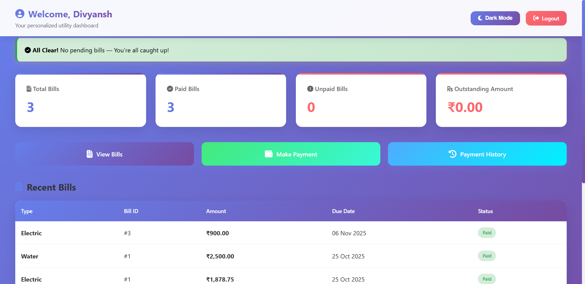
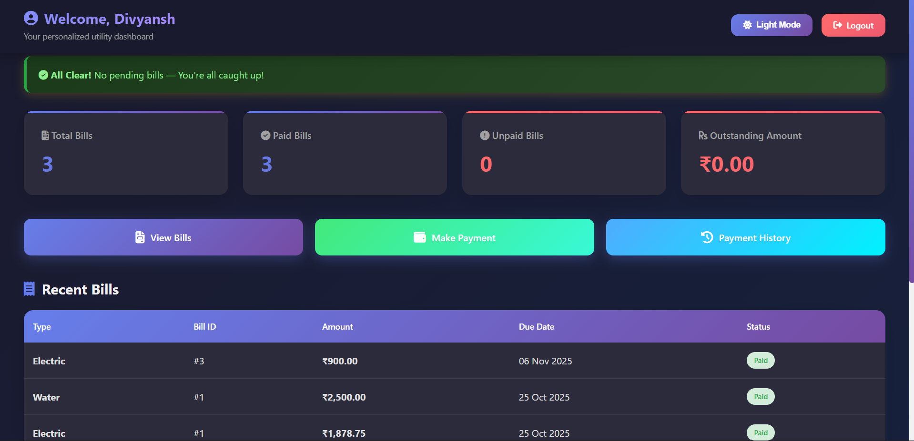

<!-- PROJECT LOGO -->
<div align="center">
  
  <h1><strong>Public Utility Management System</strong></h1>
  <p align="center">
    A complete PHP & MySQL web-based system for managing public utility operations like billing, payments, and user administration with a modern UI.
    <br />
    Streamlining customer service, automated billing, and real-time revenue tracking for electricity and water utilities.
    <br />
    <br />
    <a href="#-demo"><strong>Explore Features »</strong></a>
    <br />
    <br />
    <a href="#-demo">View Demo</a>
    ·
    <a href="#-installation">Installation Guide</a>
    ·
    <a href="#-usage">Usage</a>
    ·
    <a href="#-contributing">Contributing</a>
  </p>
</div>

---

<!-- BADGES -->
<div align="center">


</div>

---

## 📋 Table of Contents

- [About the Project](#about-the-project)
- [Demo](#demo)
- [Features](#features)
- [Tech Stack](#tech-stack)
- [Installation](#installation)
- [Usage](#usage)
- [Database Schema](#database-schema)
- [Screenshots](#screenshots)
- [Security Features](#security-features)
- [Roadmap](#roadmap)
- [Contributing](#contributing)
- [Bug Reports & Feature Requests](#bug-reports--feature-requests)
- [License](#license)
- [Author](#author)
- [Acknowledgments](#acknowledgments)
- [Support](#support)

---

## 🎬 Demo {#demo}

### Live Demo

> 🚀 **Try it now**: [Live Demo Link](https://http://localhost/public-utility-management-system) _(Coming Soon)_

### Quick Demo Setup

Want to test locally? Here's the fastest way:

```bash
# Quick setup (requires XAMPP running)
git clone https://github.com/Divyansh3105/Public-Utility-Management-System.git
cd public-utility-management-system

# Import database
mysql -u root -p < database/public_utility_system.sql

# Open in browser
http://localhost/public-utility-management-system
```

### Demo Credentials

Test the system with these pre-configured accounts:

| Role              | Email/Username              | Password  | Access Level                                 |
| ----------------- | --------------------------- | --------- | -------------------------------------------- |
| 🔑 **Admin**      | `admin`                     | `1234`    | Full system access, user management, reports |
| 👷 **Employee**   | `employee@gmail.com`        | `emp123`  | Bill generation, payment processing          |
| 👤 **Customer 1** | `divyansh.tech01@gmail.com` | `cust201` | View bills, make payments                    |
| 👤 **Customer 2** | `john@gmail.com`            | `cust202` | View bills, make payments                    |

> ⚠️ **Note**: These are demo credentials. In production, ensure all default passwords are changed immediately.

### Demo Features to Try

#### As Admin:

1. ✅ View dashboard with real-time statistics
2. ✅ Add new employee account
3. ✅ Generate monthly revenue report
4. ✅ Update electricity/water rates
5. ✅ View activity logs

#### As Employee:

1. ✅ Generate a new electricity bill
2. ✅ Process customer payment
3. ✅ Search customer records
4. ✅ View payment history
5. ✅ Generate daily report

#### As Customer:

1. ✅ View current bills
2. ✅ Make online payment
3. ✅ Download bill PDF
4. ✅ Check payment history
5. ✅ Update profile information

### Sample Data Included

The demo includes:

- 👥 **5 Customer Accounts** with varied billing history
- 👨‍💼 **3 Employee Accounts** with different roles
- 📄 **20+ Sample Bills** across multiple months
- 💰 **15+ Payment Records** showing various payment methods
- 📊 **Pre-generated Reports** for testing

---

## 📖 About The Project {#about-the-project}

The **Public Utility Management System** is a full-featured web application designed to modernize and automate the operations of public utility services. Built with PHP and MySQL, it provides a robust platform for managing electricity and water billing, customer accounts, employee operations, and financial reporting.

### 🎯 Problem Statement

Traditional utility management systems often suffer from:

- Manual billing processes prone to errors
- Lack of real-time payment tracking
- Poor customer service experience
- Inefficient employee workflows
- Limited administrative oversight

### ✅ Solution

This system addresses these challenges by providing:

- **Automated billing generation** for electricity and water services
- **Real-time payment processing** and verification
- **Role-based access control** for security and efficiency
- **Comprehensive reporting** and analytics
- **User-friendly interfaces** for all stakeholders

---

## ✨ Features {#features}

### 👑 Admin Dashboard

- **User Management**

  - Create, update, and delete employee accounts
  - Manage customer profiles and service connections
  - Assign roles and permissions

- **Financial Oversight**

  - Monitor total revenue and outstanding payments
  - View real-time billing statistics
  - Track payment trends and patterns

- **Reporting & Analytics**

  - Generate comprehensive reports (daily, monthly, yearly)
  - Export data in multiple formats (PDF, Excel, CSV)
  - Visualize key performance indicators

- **System Configuration**

  - Update utility rates dynamically
  - Configure billing cycles
  - Manage system settings

- **Activity Monitoring**
  - Complete audit trail of all operations
  - Track user actions and system events
  - Security logs and access records

### 👷 Employee Dashboard

- **Billing Operations**

  - Generate bills based on meter readings
  - Update existing bill information
  - Apply discounts and adjustments
  - Handle bill corrections

- **Payment Management**

  - Process and verify customer payments
  - Update payment status (pending, completed, failed)
  - Handle cash and online transactions
  - Generate payment receipts

- **Customer Service**

  - View comprehensive customer records
  - Search and filter customer data
  - Access payment and billing history
  - Manage service requests

- **Performance Tracking**
  - View personal performance metrics
  - Generate employee-specific reports
  - Track daily activities

### 👤 Customer Portal

- **Bill Management**

  - View current and past bills
  - Download bills in PDF format
  - Track billing history
  - View detailed consumption data

- **Payment Services**

  - Make secure online payments
  - Record cash payments
  - View payment confirmation
  - Download payment receipts

- **Account Management**

  - Update personal information
  - View connection details
  - Track service status
  - Access support resources

- **Notifications**
  - Real-time bill generation alerts
  - Payment due reminders
  - Service announcements

---

## 🛠️ Tech Stack {#tech-stack}

### Frontend

- **HTML5** - Structure and semantic markup
- **CSS3** - Modern styling with custom themes
  - Responsive grid layouts
  - Dark/Light mode toggle
  - CSS animations and transitions
- **JavaScript (Vanilla)** - Interactive functionality
  - Form validation
  - Dynamic content loading
  - Real-time search and filtering

### Backend

- **PHP 8.0+** - Server-side logic
  - Object-oriented programming
  - Secure session management
  - Database abstraction layer

### Database

- **MySQL 10.4+** - Relational database
  - Normalized schema design
  - Optimized queries with indexing
  - Transaction support

### Server Environment

- **Apache** - Web server
- **XAMPP/LAMP/WAMP** - Development stack

---

## ⚙️ Installation {#installation}

### Prerequisites

Before you begin, ensure you have the following installed:

- **XAMPP** (v8.0+) or **LAMP/WAMP**
  - Download: [https://www.apachefriends.org/download.html](https://www.apachefriends.org/download.html)
- **PHP** (≥ 8.0)
- **MySQL** (≥ 10.4)
- Modern web browser (Chrome, Firefox, Edge, Safari)

### Step-by-Step Installation

1. **Clone the Repository**

   ```bash
   git clone https://github.com/Divyansh3105/Public-Utility-Management-System.git
   cd public-utility-management-system
   ```

2. **Move to Web Server Directory**

   ```bash
   # For XAMPP on Windows
   copy public-utility-management-system C:\xampp\htdocs\

   # For XAMPP on Linux/Mac
   cp -r public-utility-management-system /opt/lampp/htdocs/
   ```

3. **Database Setup**

   a. Open phpMyAdmin

   ```
   http://localhost/phpmyadmin
   ```

   b. Create a new database

   ```sql
   CREATE DATABASE public_utility_system;
   ```

   c. Import the SQL file

   - Click on the `public_utility_system` database
   - Navigate to the "Import" tab
   - Choose the file `public_utility_system.sql`
   - Click "Go" to execute

4. **Configure Database Connection**

   Edit `db_connect.php` if needed:

   ```php
   <?php
   $host = 'localhost';
   $dbname = 'public_utility_system';
   $username = 'root';
   $password = ''; // Your MySQL password
   ?>
   ```

5. **Start the Server**

   - Open XAMPP Control Panel
   - Start **Apache** and **MySQL** services
   - Ensure both are running (green indicators)

6. **Access the Application**
   ```
   http://localhost/public-utility-management-system
   ```

### Default Login Credentials

| Role     | Username/Email              | Password  |
| -------- | --------------------------- | --------- |
| Admin    | `admin`                     | `1234`    |
| Employee | `employee@gmail.com`        | `emp123`  |
| Customer | `divyansh.tech01@gmail.com` | `cust201` |

> ⚠️ **Security Notice**: Change default passwords immediately after first login in a production environment.

---

## 💻 Usage {#usage}

### For Administrators

1. **Login** to the admin dashboard
2. **Manage Users** - Add/edit employees and customers
3. **Monitor Operations** - View real-time statistics
4. **Generate Reports** - Access comprehensive analytics
5. **Configure System** - Update rates and settings

### For Employees

1. **Login** to the employee dashboard
2. **Generate Bills** - Enter meter readings and create bills
3. **Process Payments** - Verify and update payment records
4. **Customer Support** - Access customer information
5. **Reports** - View performance metrics

### For Customers

1. **Login** to the customer portal
2. **View Bills** - Check current and past bills
3. **Make Payments** - Pay bills online or record cash payments
4. **Download Documents** - Get PDF bills and receipts
5. **Track History** - Monitor payment and billing history

---

## 🗂️ Project Structure

```
public_utility_management_system/
│
├── 📁 assets/
│   └── style.css              # Main stylesheet
│
├── 📁 admin/
│   ├── dashboard_admin.php    # Admin dashboard
│   ├── manage_customers.php   # Customer management
│   ├── manage_employees.php   # Employee management
│   ├── activity_log.php       # System logs
│   ├── view_logs.php          # Log viewer
│   ├── view_bills.php         # Bill viewer
│   ├── view_payments.php      # Payment history
│   └── report_data.php        # Report generation
│
├── 📁 employee/
│   ├── dashboard_employee.php        # Employee dashboard
│   ├── employee_generate_bill.php    # Bill creation
│   ├── employee_update_payment.php   # Payment processing
│   ├── employee_reports.php          # Employee reports
│   └── employee_logs.php             # Log viewer
│
├── 📁 customer/
│   ├── dashboard_customer.php        # Customer dashboard
│   ├── customer_view_bills.php       # Bill viewer
│   ├── customer_make_payment.php     # Payment portal
│   └── customer_payment_history.php  # Payment history
│
├── 📁 includes/
│   ├── db_connect.php         # Database connection
│   ├── log_functions.php      # Logging utilities
│
├── 📁 database/
│   └── public_utility_system.sql  # Database schema
│
├── index.php                  # Landing/Login page
├── logout.php                 # Session termination
├── README.md                  # Documentation (this file)
└── LICENSE                    # MIT License
```

---

## 🗄️ Database Schema {#database-schema}

### Core Tables

#### `admin`

Stores administrator credentials and access levels.

| Column     | Type         | Description           |
| ---------- | ------------ | --------------------- |
| admin_id   | INT (PK)     | Unique identifier     |
| username   | VARCHAR(50)  | Login username        |
| password   | VARCHAR(255) | Hashed password       |
| email      | VARCHAR(100) | Contact email         |
| created_at | TIMESTAMP    | Account creation date |

#### `employee`

Manages employee information and authentication.

| Column      | Type         | Description           |
| ----------- | ------------ | --------------------- |
| employee_id | INT (PK)     | Unique identifier     |
| name        | VARCHAR(100) | Full name             |
| email       | VARCHAR(100) | Email (login)         |
| password    | VARCHAR(255) | Hashed password       |
| phone       | VARCHAR(15)  | Contact number        |
| role        | ENUM         | Job role/designation  |
| hired_date  | DATE         | Employment start date |
| status      | ENUM         | Active/Inactive       |

#### `customer`

Stores customer profiles and service connections.

| Column            | Type         | Description           |
| ----------------- | ------------ | --------------------- |
| customer_id       | INT (PK)     | Unique identifier     |
| name              | VARCHAR(100) | Full name             |
| email             | VARCHAR(100) | Email (login)         |
| password          | VARCHAR(255) | Hashed password       |
| phone             | VARCHAR(15)  | Contact number        |
| address           | TEXT         | Service address       |
| connection_type   | ENUM         | Electric/Water/Both   |
| meter_number      | VARCHAR(50)  | Meter identifier      |
| registration_date | TIMESTAMP    | Account creation date |

#### `electric_bill`

Tracks electricity billing records.

| Column           | Type          | Description           |
| ---------------- | ------------- | --------------------- |
| bill_id          | INT (PK)      | Unique identifier     |
| customer_id      | INT (FK)      | Customer reference    |
| bill_month       | VARCHAR(20)   | Billing period        |
| previous_reading | DECIMAL(10,2) | Last meter reading    |
| current_reading  | DECIMAL(10,2) | Current meter reading |
| units_consumed   | DECIMAL(10,2) | Usage amount          |
| rate_per_unit    | DECIMAL(10,2) | Current rate          |
| total_amount     | DECIMAL(10,2) | Bill total            |
| due_date         | DATE          | Payment deadline      |
| status           | ENUM          | Paid/Unpaid/Overdue   |
| generated_by     | INT (FK)      | Employee who created  |
| created_at       | TIMESTAMP     | Bill generation date  |

#### `water_bill`

Manages water billing information (similar structure to electric_bill).

#### `payment`

Records all payment transactions.

| Column         | Type          | Description            |
| -------------- | ------------- | ---------------------- |
| payment_id     | INT (PK)      | Unique identifier      |
| bill_id        | INT (FK)      | Associated bill        |
| customer_id    | INT (FK)      | Customer reference     |
| amount         | DECIMAL(10,2) | Payment amount         |
| payment_method | ENUM          | Cash/Online/Card       |
| payment_date   | TIMESTAMP     | Transaction date       |
| verified_by    | INT (FK)      | Employee who verified  |
| status         | ENUM          | Success/Pending/Failed |
| transaction_id | VARCHAR(100)  | External reference     |

#### `activity_log`

Audit trail for system operations.

| Column     | Type         | Description               |
| ---------- | ------------ | ------------------------- |
| log_id     | INT (PK)     | Unique identifier         |
| user_id    | INT          | User who performed action |
| user_type  | ENUM         | Admin/Employee/Customer   |
| action     | VARCHAR(255) | Action description        |
| table_name | VARCHAR(50)  | Affected table            |
| record_id  | INT          | Affected record           |
| timestamp  | TIMESTAMP    | Action time               |
| ip_address | VARCHAR(45)  | User IP                   |

#### `report_data`

Stores generated reports and analytics.

| Column        | Type          | Description          |
| ------------- | ------------- | -------------------- |
| report_id     | INT (PK)      | Unique identifier    |
| report_type   | VARCHAR(50)   | Report category      |
| generated_by  | INT (FK)      | Creator reference    |
| date_from     | DATE          | Report start date    |
| date_to       | DATE          | Report end date      |
| total_bills   | INT           | Bills in period      |
| total_revenue | DECIMAL(15,2) | Revenue amount       |
| created_at    | TIMESTAMP     | Generation timestamp |

---

## 🖼️ Screenshots {#screenshots}

### Admin Dashboard



_Comprehensive overview with revenue tracking, bill statistics, and quick actions_

### Admin Dashboard



_Intuitive interface for meter reading entry and bill generation_

### Customer Portal



_User-friendly portal for viewing bills and making payments_

### Dark Mode



_Eye-friendly dark theme for extended usage_

---

## 🔐 Security Features {#security-features}

- **Authentication & Authorization**

  - Secure session management
  - Role-based access control (RBAC)
  - Password hashing using PHP's `password_hash()`

- **Data Protection**

  - SQL injection prevention with prepared statements
  - XSS protection through input sanitization
  - CSRF token implementation

- **Audit Trail**

  - Complete activity logging
  - IP address tracking
  - Timestamp recording for all actions

- **Best Practices**
  - Secure password policies
  - Session timeout implementation
  - Error handling without information disclosure

---

## 🚀 Roadmap {#roadmap}

### Phase 1 - Current Features ✅

- [x] User management (Admin, Employee, Customer)
- [x] Bill generation and management
- [x] Payment processing
- [x] Reporting system
- [x] Activity logging

### Phase 2 - Short Term 🎯

- [ ] **Payment Gateway Integration**

  - UPI payments (PhonePe, Google Pay, Paytm)
  - Credit/Debit card processing
  - Net banking

- [ ] **Enhanced Reporting**

  - Interactive charts (Chart.js)
  - Advanced analytics dashboard
  - Export to multiple formats

- [ ] **Notification System**
  - Email notifications (bill generation, payment reminders)
  - SMS alerts
  - In-app notifications

### Phase 3 - Medium Term 📱

- [ ] **Mobile Application**

  - REST API development
  - Android app (React Native/Flutter)
  - iOS app

- [ ] **Advanced Features**

  - Automated meter reading integration
  - Predictive consumption analytics
  - Smart billing algorithms

- [ ] **Customer Self-Service**
  - Service request management
  - Complaint tracking
  - Live chat support

### Phase 4 - Long Term 🌐

- [ ] **Multi-utility Support**

  - Gas billing
  - Internet services
  - Other utilities

- [ ] **AI Integration**
  - Consumption pattern prediction
  - Fraud detection
  - Chatbot support

---

## 🤝 Contributing {#contributing}

Contributions make the open-source community an amazing place to learn, inspire, and create. Any contributions you make are **greatly appreciated**.

### How to Contribute

1. **Fork the Project**

   ```bash
   # Click the 'Fork' button on GitHub
   ```

2. **Clone Your Fork**

   ```bash
   git clone https://github.com/Divyansh3105/Public-Utility-Management-System.git
   cd public-utility-management-system
   ```

3. **Create a Feature Branch**

   ```bash
   git checkout -b feature/AmazingFeature
   ```

4. **Make Your Changes**

   - Write clean, documented code
   - Follow existing code style
   - Test thoroughly

5. **Commit Your Changes**

   ```bash
   git add .
   git commit -m "Add: Amazing new feature"
   ```

6. **Push to Your Branch**

   ```bash
   git push origin feature/AmazingFeature
   ```

7. **Open a Pull Request**
   - Go to the original repository
   - Click "New Pull Request"
   - Describe your changes in detail

### Contribution Guidelines

- **Code Style**: Follow PSR-12 coding standards for PHP
- **Documentation**: Update README for new features
- **Testing**: Ensure all functionality works before submitting
- **Commits**: Use clear, descriptive commit messages
- **Issues**: Check existing issues before creating new ones

---

## 🐛 Bug Reports & Feature Requests {#bug-reports--feature-requests}

Found a bug or have a feature suggestion?

- **Bug Reports**: [Open an issue](https://github.com/Divyansh3105/public-utility-management-system/issues) with the "bug" label
- **Feature Requests**: [Open an issue](https://github.com/Divyansh3105/public-utility-management-system/issues) with the "enhancement" label

Please include:

- Clear description
- Steps to reproduce (for bugs)
- Expected vs actual behavior
- Screenshots if applicable
- Environment details (OS, browser, PHP version)

---

## 📄 License {#license}

This project is licensed under the **MIT License** - see the [LICENSE](LICENSE) file for details.

### MIT License Summary

- ✅ Commercial use
- ✅ Modification
- ✅ Distribution
- ✅ Private use
- ⚠️ Liability and warranty disclaimer

---

## 👤 Author {#author}

<div align="center">

### **Divyansh**

🎓 B.Tech in Computer Science & Engineering
💻 Full-Stack Developer | Student Innovator
🌟 Passionate about building practical solutions

[](mailto:divyanshgarg3105@gmail.com)
[](https://github.com/Divyansh3105)
[](www.linkedin.com/in/divyanshgarg3105)

</div>

---

## 🙏 Acknowledgments {#acknowledgments}

- **Icons**: [Icons8](https://icons8.com)
- **Badges**: [Shields.io](https://shields.io)
- **Inspiration**: Real-world utility management challenges
- **Testing**: Community feedback and beta testers

---

## 📞 Support {#support}

Need help? Here's how to get support:

- 📖 **Documentation**: Check this README and code comments
- 💬 **Discussions**: [GitHub Discussions](https://github.com/Divyansh3105/public-utility-management-system/discussions)
- 🐛 **Issues**: [Report bugs](https://github.com/Divyansh3105/public-utility-management-system/issues)
- 📧 **Email**: divyansh.tech01@gmail.com

---

<div align="center">

### ⭐ If this project helped you, please give it a star! ⭐

---

**"Digitizing utility management for a smarter, more efficient future."**

---

Made with ❤️ by [Divyansh](https://github.com/Divyansh3105)


</div>
